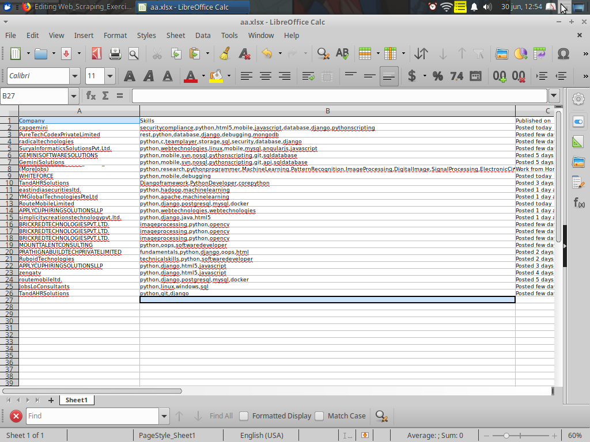

Note: Even if currently functional this project is under development. Having said that, I continue to explain what it does:

This webscraper access this [website](https://www.timesjobs.com/candidate/job-search.html?searchType=personalizedSearch&from=submit&txtKeywords=python&txtLocation=) (a website for job search; having searched "python jobs") then selects the jobs that have the required specificities that I ask it like:

* industy
* Company name
* current 
* amount of people that have already applied 
* salary 
* seniority 
* location 
* currency
* required skills

Then extracts that information and stores it in an excel that is sent to my email address. This operation is repeated every 10 minutes.I'll upload this to a cloud server so it stays up and running during the whole day.

Even if it needs to be polished a lot to be something that could be selled I think this is a great start.

Project inspired by this FreeCodeAcademy's [Video](https://www.youtube.com/watch?v=XVv6mJpFOb0)

 

